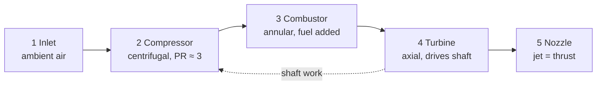

# Micro Turbojet: Parametric CAD + Cycle Physics

A parametric CAD model of a small **KJ66-class turbojet** (about 110 mm diameter, 234 mm long) built with [CadQuery](https://github.com/CadQuery/cadquery), plus a first-order thermodynamic estimate of how it would perform. Built as a college science/robotics project study, with the long-term goal of powering a small model fighter jet.

| Full-section view | Open-body (cutaway) view |
|---|---|
|  |  |

> **Status: design study, not a validated engine.** The geometry is a believable first draft. It has not been CFD-checked, stress-checked, balanced, built or run. See [Known limitations](#known-limitations) before you machine anything.

---

## Contents

1. [Repository layout](#repository-layout)
2. [How a turbojet works](#how-a-turbojet-works)
3. [The physics, stage by stage](#the-physics-stage-by-stage)
4. [Results for this design](#results-for-this-design)
5. [CAD model description](#cad-model-description)
6. [Known limitations](#known-limitations)
7. [Rebuilding the model](#rebuilding-the-model)
8. [Scaling up to a 1–2 m fighter jet](#scaling-up-to-a-12-m-fighter-jet)
9. [Safety](#safety)
10. [References](#references)

---

## Repository layout

```
cad/        STEP (editable, named parts, colours) and STL (mesh) exports
            turbojet.step / .stl             complete engine
            turbojet_cutaway.step / .stl     top half of static shells removed
images/     preview renders
src/
  build_turbojet.py    parametric model, 16 named parts -> STEP/STL
  build_cutaway.py     open-body variant
  engine_calcs.py      mean-line cycle estimate used in this README
```

Units are **millimetres**. The engine axis is **+X**; the inlet lip is at x = 0 and the nozzle exit at x ≈ 234.

---

## How a turbojet works

A turbojet is a heat engine running the **Brayton cycle**, in four steps:

1. **Compress** the incoming air (compressor wheel and diffuser).
2. **Add heat** by burning fuel in it at roughly constant pressure (combustor).
3. **Expand** part of the hot gas through a turbine that extracts *just enough* work to drive the compressor.
4. **Expand the rest** through a nozzle into a fast jet. The leftover energy becomes thrust.



Everything in the engine is one rotating assembly (compressor wheel, shaft, turbine wheel) spinning at **100,000+ RPM**, supported on two bearings.

---

## The physics, stage by stage

Notation: `T` temperature, `P` pressure, `U` blade speed, `c_p` specific heat, `γ` heat-capacity ratio, `η` efficiency, `ṁ` mass flow. Subscript `0` means total (stagnation) conditions.

### 1. Compressor: centrifugal wheel

Work input comes from **Euler's turbomachinery equation**. With no swirl at the inlet:

$$w_c = \sigma\,U_2^{2}$$

- `U₂ = πD₂N/60` is the blade tip speed (D₂ = 66 mm here).
- `σ` is the **slip factor**: the air leaves the wheel slightly "lagging" the blade. For radial blades the Wiesner correlation gives `σ = 1 − 1/Z^0.7`, where Z is the blade count (16 counting splitters, so σ ≈ 0.86).

The temperature rise and resulting **pressure ratio** follow from the isentropic relation with compressor efficiency η_c:

$$\Delta T_{0c}=\frac{w_c}{c_{p}},\qquad
PR_c=\left(1+\frac{\eta_c\,\Delta T_{0c}}{T_{01}}\right)^{\frac{\gamma}{\gamma-1}}$$

The pressure ratio rises as roughly **N²**, which is why these engines need such huge rotational speeds. The inducer's relative tip Mach number (`M = √(U₁ₜ² + Cₐ²)/a`) is kept below about 0.9 to avoid shock losses at the intake.

### 2. Diffuser

The air leaves the wheel at over 400 m/s, which is fast and kinetically "wasteful." The vaned diffuser slows it down, converting velocity into static pressure. A diffuser with too large an area change stalls (the flow separates), so vane angle and length matter.

### 3. Combustor: annular, vaporizer type

Fuel (kerosene or Jet-A) is injected into **vaporizer tubes** that sit in the hot flame zone, so the fuel boils before it mixes. Air enters the liner in stages:

- **Primary holes**: roughly stoichiometric burn at the front.
- **Dilution holes**: cool the gas from about 2000 K down to the turbine inlet temperature (TIT), around 1050 K here, which is the limit of what the turbine metal survives.

The fuel-to-air ratio comes from an energy balance:

$$f=\frac{c_{p,h}\,T_{03}-c_{p,c}\,T_{02}}{\eta_b\,H_{u}-c_{p,h}\,T_{03}}$$

with `H_u ≈ 43 MJ/kg` for kerosene. Real air is about 4× richer in oxygen than the primary zone needs, so overall the engine runs very lean (f ≈ 0.02). A pressure loss across the combustor of about 5% is assumed.

### 4. Turbine: axial, single stage

A ring of **nozzle guide vanes** (13) accelerates and turns the gas so it hits the **rotor blades** (12) at the right angle. The turbine must produce exactly the compressor's work, plus bearing and windage losses (mechanical efficiency η_m ≈ 0.98):

$$w_t=\frac{w_c}{\eta_m},\qquad
\Delta T_{0t}=\frac{w_t}{c_{p,h}},\qquad
PR_t=\left(1-\frac{\Delta T_{0t}}{\eta_t\,T_{03}}\right)^{-\frac{\gamma_h}{\gamma_h-1}}$$

The turbine is the most heat-stressed part of the engine: hot gas, high speed, high centrifugal load. Real hobby wheels are machined or cast from nickel superalloy (e.g. Inconel).

### 5. Nozzle and thrust

What pressure is left after the turbine is expanded through the nozzle. If `P₀₄/Pₐ` is above the critical ratio (about 1.85) the nozzle **chokes** (exit at Mach 1); otherwise the exit velocity is

$$V_e=\sqrt{2\,c_{p,h}\,T_{04}\,\eta_n\left[1-\left(\tfrac{P_a}{P_{04}}\right)^{\frac{\gamma_h-1}{\gamma_h}}\right]}$$

and for a static engine (no forward speed) **thrust** is

$$F=\dot m_{tot}\,V_e+(p_e-p_a)A_e$$

The second term is the pressure thrust, zero for a fully-expanded subsonic nozzle.

The nozzle exit *area* is not a free choice. By continuity, `ṁ = ρₑ Vₑ Aₑ`, so the exit area must match the flow. Too large and the turbine back-pressure drops; too small and the compressor surges.

---

## Results for this design

Produced by [`src/engine_calcs.py`](src/engine_calcs.py). Inputs read from the CAD model; efficiencies, speed and TIT are **assumptions** typical of hobby turbines.

**Assumptions:** 120,000 RPM, η_c = 0.75, η_t = 0.80, η_n = 0.95, η_m = 0.98, combustor ΔP = 5%, TIT = 1050 K, inducer axial velocity 110 m/s, ISA sea level.

| Quantity | Result |
|---|---|
| Compressor tip speed U₂ | 415 m/s |
| Slip factor | 0.86 |
| Specific compressor work | 147 kJ/kg (ΔT ≈ 147 K) |
| **Pressure ratio** | **3.1** |
| Inducer relative tip Mach | 0.86 |
| Air mass flow | 0.157 kg/s |
| Fuel-air ratio / fuel flow | 0.019 / ~11 kg/h |
| Turbine pressure ratio | 1.94 (ΔT ≈ 128 K) |
| Exhaust total temperature | ~920 K |
| Nozzle exit velocity | ~445 m/s (subsonic) |
| **Static thrust** | **~70 N** |

These are sensible numbers. Commercial KJ66-class engines quote around 80–110 N at 100–120k RPM with higher mass flow, so this model sits slightly under that range. The estimate is first-order (mean-line, constant specific heats, no tip-clearance, windage, or off-design effects) and should be trusted to roughly ±30%.

---

## CAD model description

16 named parts, all valid solids with **zero part-to-part interference** (checked pairwise with OpenCascade boolean intersection).

| Part | Notes |
|---|---|
| `intake_shell` | Elliptical bellmouth to compressor shroud |
| `compressor_wheel` | Ø66 mm, 8 main + 8 splitter blades, radial exit |
| `diffuser` | 15 straight vanes at 22° |
| `casing` | Ø110 mm outer, converges to the nozzle |
| `combustor_outer / _inner / _dome` | Annular liners with primary + dilution holes |
| `fuel_system` | Fuel ring, 12 feed stems, 12 vaporizer tubes |
| `ngv` | 13 twisted nozzle guide vanes in two end rings |
| `turbine_wheel` | Ø67 mm, 12 twisted blades |
| `shaft` | Ø8 mm |
| `bearing_tunnel`, `bearing_front`, `bearing_rear` | Shaft housing and two bearing seats |
| `support_spider` | Three struts holding the bearing tunnel |
| `exhaust_cone` | Tail cone |

---

## Known limitations

Please read these before using the model for anything real.

1. **Nozzle exit area is too large.** The cycle calculation needs roughly **850 mm²** of exit area at design flow; the CAD has about **2,780 mm²** (3.3× too big). Built as drawn, the turbine would see low back-pressure and the engine would not hold its design point. The nozzle needs to be necked down (exit diameter of about 45–50 mm is the usual KJ66 range).
2. **Blades are placeholder shapes.** Compressor and diffuser blades are flat plates; turbine and guide-vane blades are simple twisted rectangles, not designed aerofoils. Real performance depends on velocity triangles, blade angles and tip clearance, which need CFD or turbomachinery design tools.
3. **No structural, thermal or rotor-dynamic analysis.** Disc stress at 120k RPM, blade resonance, critical speeds and thermal growth were not checked.
4. **Missing systems:** no starter, fuel pump/valve, ignition, oil system, ECU, mounting, or instrumentation. The shaft has no lock-nut or balancing features.
5. **Bearing housing is simplified.** The rotor is held by three thin struts and plain bearing seats; there is no preload spring or cooling-air path.
6. Efficiencies, TIT and mass flow in the physics are assumed, not measured.

---

## Rebuilding the model

Requires Python 3.9+ and CadQuery (`pip install cadquery`).

```bash
pip install -r requirements.txt
python src/build_turbojet.py cad      # full engine  -> cad/turbojet.step / .stl
python src/build_cutaway.py cad       # open body    -> cad/turbojet_cutaway.step / .stl
python src/engine_calcs.py            # cycle estimate
```

Run the scripts from the repo root; `build_cutaway.py` imports `build_turbojet.py` from `src/`. Dimensions are plain numbers inside each part function. Blade counts are constants at the top of `build_turbojet.py`.

**Opening in CAD:** use the `.step` files. They preserve solids, part names and colours. Fusion 360 (Data Panel → Upload), SolidWorks (File → Open, tick "Import as assembly"), Onshape (Import), and FreeCAD (File → Open) all read them. Check that units are set to mm. The `.stl` files are meshes for 3D printing or Blender only.

---

## Scaling up to a 1–2 m fighter jet

- A hobby jet of **1–1.5 m** typically uses one **80–150 N** turbine. A 2 m airframe usually needs more thrust, or twin engines.
- Rule of thumb for model jets: **thrust ≥ ½ of take-off weight** for comfortable flight, ideally closer to 1:1 for aerobatics.
- **Inlet and exhaust ducting** dominate the airframe design: smooth, short inlet ducts (low pressure loss) and a heat-shielded tailpipe matter as much as the engine.
- The engine's thrust *changes* with forward speed and altitude; static thrust is only the starting point.
- For a college project, **buying a certified commercial micro-turbine** and designing the airframe around it is far safer than building one. This repo can supply an accurate dummy engine for fit-checking.

---

## Safety

Real turbojets are dangerous: rotors turn at 100,000+ RPM and a failure releases fragments at high energy; exhaust is over 600 °C; the fuel is flammable. **Do not run any engine built from this design** without proper engineering review, containment, balancing, test-cell safety, and supervision from your institution. Parts of this model are not validated.

---

## References

- H.I.H. Saravanamuttoo et al., *Gas Turbine Theory*, Pearson. Cycle analysis, compressors, turbines.
- S.L. Dixon & C. Hall, *Fluid Mechanics and Thermodynamics of Turbomachinery*, Butterworth-Heinemann. Euler work, slip, velocity triangles.
- J.S. Wiesner, "A Review of Slip Factors for Centrifugal Impellers", *J. Eng. Power*, 1967. Slip factor correlation.
- T. Kamps, *Model Jet Engines*, Traplet. Hobby-scale turbojet construction.
- [CadQuery documentation](https://cadquery.readthedocs.io/)

## License

MIT, see [LICENSE](LICENSE).
